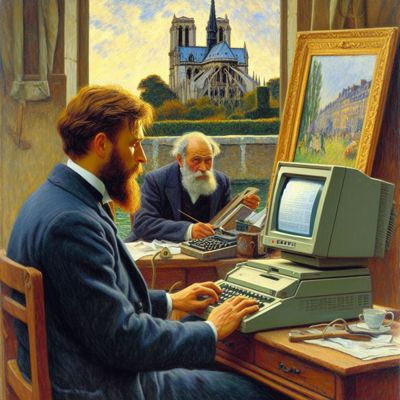

# claude-shell

Anthropic's [Claude](https://www.anthropic.com/claude) integration in Emacs
based on [`shell-maker`](https://github.com/xenodium/chatgpt-shell/).

<div align="center">

|                                  |
|:-----------------------------------------------------------------------------------------------------------------:|
| *Slightly disturbing painting of Claude Monet painting Claude Frollow on a terminal*                              |

</div>

`claude-shell` Provides access to all Claude 3 models (Haiku, Sonnet and Opus).
The most interesting of which is probably Haiku which provides near instant
answers while still being of good quality. Similar in speed to Kagi's FastGPT
while providing subjectively better answers. 

Meanwhile Opus and ChatGPT seem to fight for the crown of the best foundational
model in general, but they tend to be sluggish enough to break the flow.


Everything below this line was written by Claude 3 Opus. 

> Assistant: Why? 
> User: Because. 

I'll clean it up later. Promise. 🤞

---

## Features

- Interact with Claude directly within Emacs
- Choose from different Claude models
- Customize system prompts for various use cases
- Stream responses for real-time interaction
- Syntax highlighting for code snippets in responses

## Installation

1. Ensure you have Emacs 29.1 or higher installed.
2. Install the `shell-maker` package (version 0.49.1 or higher).
3. Clone this repository or install the `claude-shell` package from MELPA.
4. Set your Anthropic API token:
   ```elisp
   (setq claude-shell-api-token "your-api-token")
   ```
   You can generate an API token in your Anthropic account settings: https://console.anthropic.com/settings/keys

## Usage

To start a Claude Shell session, run:

```
M-x claude-shell
```

This will open a new buffer where you can interact with Claude. Type your queries and press `Enter` to send them to the AI assistant.

To swap the system prompt, use:

```
M-x claude-shell-swap-system-prompt
```

This allows you to choose from a list of predefined system prompts or set a custom one.

## Customization

You can customize various aspects of Claude Shell using the following variables:

- `claude-shell-api-token`: Your Anthropic API token.
- `claude-shell-model`: The Claude model to use (default: "claude-3-haiku-20240307").
- `claude-shell-system-prompts`: A list of predefined system prompts.
- `claude-shell-system-prompt`: The currently active system prompt (default: "Programming").
- `claude-shell-streaming`: Whether to stream responses or wait for the full response (default: nil).
- `claude-shell-after-command-functions`: An abnormal hook invoked after each command, allowing for custom post-processing.

## Contributing

Contributions are welcome! If you find any issues or have suggestions for improvements, please open an issue or submit a pull request on the GitHub repository.

## License

This package is released under the MIT License. See the `LICENSE` file for more information.


