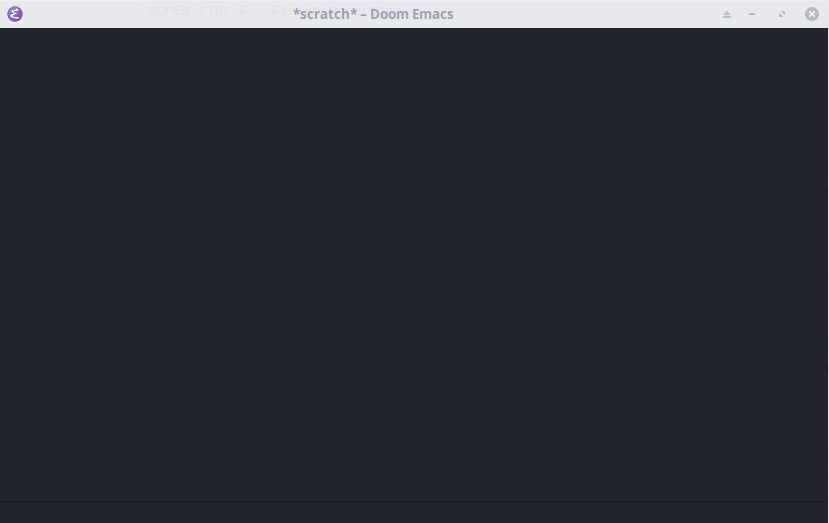

# claude-shell


[](https://melpa.org/#/claude-shell)


Anthropic's [Claude](https://www.anthropic.com/claude) integration in Emacs
based on [`shell-maker`](https://github.com/xenodium/chatgpt-shell/).

<div align="center">

|                                  |
|:-----------------------------------------------------------------------------------------------------------------:|
| *Slightly disturbing painting of Claude Monet painting Claude Frollow on a terminal*                              |

</div>

`claude-shell` provides access to all Claude 3 models (Haiku, Sonnet and Opus).

The most interesting of which is probably Haiku which provides near instant
answers while still being of good quality. Similar in speed to Kagi's FastGPT
while providing subjectively better answers.

Meanwhile Opus and ChatGPT seem to fight for the crown of the best foundational
model in general, but they tend to be sluggish enough to break one's flow.

Sonnet is somewhere in the middle.

## Features



- Chat with Claude in a dedicated Emacs buffer
- Switch Claude models
- Switch system prompts and load more [awesome
  prompts](https://github.com/f/awesome-chatgpt-prompts)
- Response streaming
- Syntax highlighting

## Installation
`claude-shell` needs an API token from Anthropic. You can generate one in your
account https://console.anthropic.com/settings/keys. This must be set to
`claude-shell-api-token` either as string or a function to fetch the token.

``` elisp
;;; Set API token directly as a string
(setq claude-shell-api-token "sk-ant-api03-your-token")

;;; Fetch API token from `auth-source` (e.g. .authinfo.gpg)
(setq claude-shell-api-token (lambda () (auth-source-pick-first-password :host "api.anthropic.com")))
```

### Manual

1. Install `shell-maker` from https://github.com/xenodium/chatgpt-shell/
2. Clone the repository and evaluate `claude-shell-fontifier.el` and
`claude-shell.el` in Emacs. 
3. Then set the `claude-shell-api-token` variable to your API token. You can
   generate an API token in your Anthropic account settings:
   https://console.anthropic.com/settings/keys

### `package.el`
`claude-shell` is in [Melpa](https://melpa.org/#/claude-shell) and so installing
via the built-in `package.el` is as simple as setting up Melpa [as package
source](https://melpa.org/#/getting-started).

Then you can use `M-x package-refresh-contents` and `M-x package-install` to
install `claude-shell`.

### `straight.el` and `use-package`

`claude-shell` can easily be installed with
[straight.el](https://github.com/radian-software/straight.el) and
[use-package](https://github.com/jwiegley/use-package). 

If you have Melpa in your [package sources](https://melpa.org/#/getting-started)
already you can just install and configure the package as usual:
``` elisp
(use-package claude-shell
  :straight (claude-shell :type git :host github :repo "arminfriedl/claude-shell")
  :config
  (setq claude-shell-api-token "sk-ant-api03-your-token"))

```

In case you don't have and don't want to add Melpa to your package sources you
can also install it directly from source:
``` elisp
(use-package claude-shell
  :straight (claude-shell :type git :host github :repo "arminfriedl/claude-shell")
  :config
  (setq claude-shell-api-token "sk-ant-api03-your-token"))

```

### Doom Emacs

In your `package.el` add

``` elisp
(package! claude-shell
  :recipe (:host github :repo "arminfriedl/claude-shell"
          :files ("claude-shell.el" "claude-shell-fontifier.el")))
```

In your `config.el` add

``` elisp
(use-package! claude-shell
  :config
  (setq! claude-shell-api-token "sk-ant-api03-your-token"))
```

## Usage

To start a Claude Shell session, run:
```
M-x claude-shell
```

This will open a new buffer where you can interact with Claude. Type your
queries and press `Enter` to send them to the AI assistant.

To swap the system prompt press `C-x C-s` in the \*claude\* buffer, or call:
```
M-x claude-shell-swap-system-prompt
```

This allows you to choose from a list of predefined system prompts or set a custom one.

You can load more prompts with
```
M-x claude-shell-load-awesome-prompts
```

To swap Claude models press `C-x C-v` in the \*claude\* buffer, or call:

```
M-x claude-shell-swap-model
```

## Customization

You can customize various aspects of Claude Shell using the following variables:

- `claude-shell-api-token`: Your Anthropic API token.
- `claude-shell-model`: The Claude model to use (default: "claude-3-haiku-20240307").
- `claude-shell-system-prompts`: A list of predefined system prompts.
- `claude-shell-system-prompt`: The currently active system prompt (default: "Programming").
- `claude-shell-streaming`: Whether to stream responses or wait for the full response (default: nil).
- `claude-shell-after-command-functions`: An abnormal hook invoked after each command, allowing for custom post-processing.

## Contributing

Contributions are welcome! If you find any issues or have suggestions for improvements, please open an issue or submit a pull request on the GitHub repository.

## License

This package is released under the MIT License. See the `LICENSE` file for more information.


